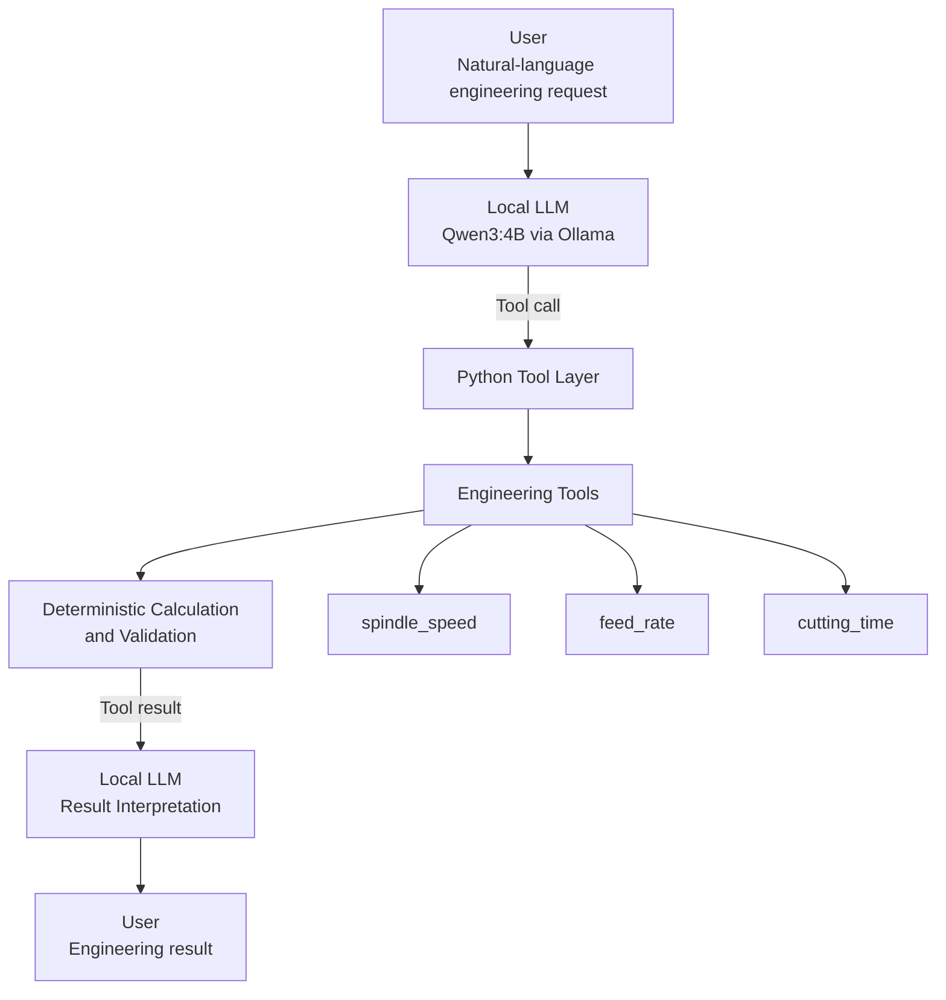

# Local AI Engineering Assistant

A local LLM-based engineering assistant that combines natural-language interaction with deterministic Python engineering tools.

The project explores how local AI can be integrated into engineering software rather than used only as a general-purpose chatbot.

## What I Built

The assistant uses a local **Qwen3:4B** language model through **Ollama** to interpret engineering requests and decide when deterministic Python tools are required.

The Python tools perform the actual engineering calculations and validation.

Current tools include:

- Spindle speed calculation
- Feed rate calculation
- Cutting time calculation

The assistant can also chain dependent calculations automatically.

For example:

> "For a 10 mm cutter at 120 m/min, with 4 teeth and 0.05 mm/tooth, how long will it take to travel 500 mm?"

The system performs:

`Spindle Speed → Feed Rate → Cutting Time`

The language model handles natural-language understanding and tool orchestration, while Python performs the numerical calculations and input validation.

## How It Works

The assistant uses a local language model to understand engineering requests and decide which deterministic Python tools are required.

1. The user provides an engineering request in natural language.
2. Qwen3:4B interprets the request and selects the required engineering tool.
3. Python executes the selected calculation with explicit inputs and validation.
4. The tool result is returned to the language model.
5. The language model interprets the result and provides the final response.
6. For multi-step requests, the model can chain multiple tools using the output of one calculation as the input to the next.

This separates **language understanding** from **numerical computation**: the LLM handles reasoning about the request and Python performs the actual engineering calculations.

## Architecture



### Example Tool Chain

```text
User
  │
  │ "10 mm cutter, 120 m/min,
  │  4 teeth, 0.05 mm/tooth,
  │  500 mm travel"
  ▼
Qwen3:4B
  │
  ├── spindle_speed()
  │       ↓
  │    3819.72 RPM
  │
  ├── feed_rate()
  │       ↓
  │    763.94 mm/min
  │
  └── cutting_time()
          ↓
       0.654 min
          │
          ▼
      Qwen3:4B
          │
          ▼
   "Approximately 39.2 seconds"
```

## Key Features

- **Local LLM inference** — Runs Qwen3:4B locally through Ollama without relying on a cloud AI API.
- **LLM tool calling** — The language model identifies when an engineering calculation requires a Python tool and requests it automatically.
- **Deterministic engineering calculations** — Python performs the numerical calculations instead of relying on the LLM for arithmetic.
- **Multi-step tool orchestration** — Supports dependent calculation chains such as:
  `spindle_speed → feed_rate → cutting_time`
- **Input validation** — Engineering tools validate their inputs and reject invalid values such as zero or negative parameters.
- **Controlled engineering responses** — The assistant is instructed not to invent engineering values or silently replace invalid inputs.
- **Modular tool architecture** — Engineering functions are separated from the LLM interaction layer through a central tool registry.
- **Fully local development** — The complete prototype runs on a laptop using local software and models.

**Current milestone:** Milestone 1 — Local LLM + deterministic engineering tool calling

## Limitations and Scope

This project is intentionally small and focused on understanding local LLM tool calling rather than building a complete AI engineering platform.

Current scope:

- Local inference using Qwen3:4B through Ollama.
- A small set of deterministic CAM-related engineering calculations.
- Python-based tool execution and input validation.
- Multi-step tool chaining for dependent calculations.
- No model training or fine-tuning.
- No RAG, vector database, or external knowledge base.
- No cloud API dependency.

The language model is used for natural-language understanding and tool orchestration. Numerical results are generated by deterministic Python functions rather than by the language model itself.

## Technology Stack

| Component | Technology |
|---|---|
| Language | Python 3.11 |
| Local LLM Runtime | Ollama |
| Language Model | Qwen3:4B |
| LLM Integration | Ollama Python Client |
| Engineering Tools | Python |
| Tool Calling | Ollama tool-calling API |
| Environment | Python virtual environment |
| Version Control | Git / GitHub |
| Hardware | NVIDIA RTX 3050 Laptop GPU (6 GB VRAM) |

### Engineering Tools

| Tool | Purpose |
|---|---|
| `spindle_speed()` | Calculates spindle speed from cutting speed and tool diameter |
| `feed_rate()` | Calculates feed rate from spindle speed, number of teeth, and feed per tooth |
| `cutting_time()` | Calculates machining time from travel distance and feed rate |

## Demo

### Successful Engineering Calculation

[Watch successful calculation demo](demo/LocalAIEngineering_demo_success.mp4)

Demonstrates:

`Natural-language request -> Qwen3:4B -> Python tool calls -> deterministic calculations -> final result`

### Invalid Input Handling

[Watch validation/error-handling demo](demo/LocalAIEngineering_demo_error.mp4)

Demonstrates:

`Invalid input -> Python validation -> controlled error response`

## Project Structure

```text
LocalAIEngineering/
├── demo/
│   ├── LocalAIEngineering_demo_error.mp4
│   └── LocalAIEngineering_demo_success.mp4
├── engineering_tools.py
├── tool_registry.py
├── test_llm.py
├── README.md
└── .gitignore

## Example: Multi-Step Engineering Calculation

A single natural-language request can trigger a sequence of dependent engineering calculations.

**Input:**

> "For a 10 mm cutter at 120 m/min, with 4 teeth and 0.05 mm/tooth, how long will it take to travel 500 mm?"

**Tool chain:**

`spindle_speed -> feed_rate -> cutting_time`

**Results:**

- Spindle speed: 3819.72 RPM
- Feed rate: 763.94 mm/min
- Cutting time: 0.6545 min

The language model is responsible for understanding the request, selecting the required tools, and interpreting the results.

The numerical calculations themselves are performed by deterministic Python functions rather than generated by the language model.